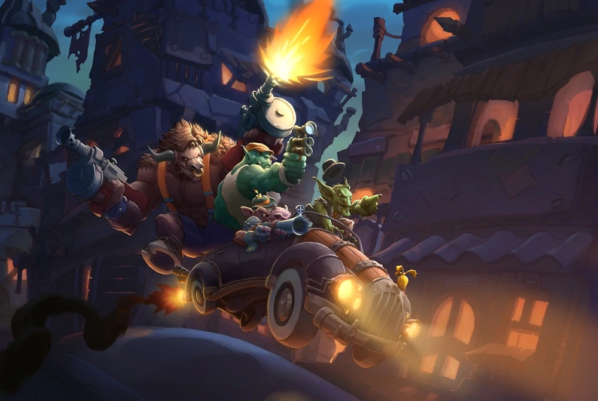

## Conflicts
{.float-right}
With the influx of traders, merchants and businessmen both respectable and otherwise, as well as the daily arrival of more fortune-seekers, Gadgetzan has never been more lively. Of course, this uptick in activity hasn’t been without its downsides. Rival organizations now battle for control of the city, with the two biggest offenders being the Guild of Dungeoneers and the Dark Talons.

Normally these conflicts would have been resolved non-violently, as bloodshed only hinder both party's abilities, but lately these clashes have been more brazen and out in the open. No one is quite sure what sparked the dispute between the two organzations but the feud is only deepening.

The City Watch is doing whatever it can to stop the volience. Fearing for the safety of the populace and the public image of Gadgetzan, the Watch has called upon the Order of the Latern to root out the source of this evil.

### The Three Sides at War
All three factions involved in the fight for Gadgetzan, the Dungeoneers, the Talons and the Laterns, go about it in different ways.

The Laterns are a lawful organization and have the blessing of the Governing body of Gadgetzan to deliver justice however they see fit. Normally reserved for the most extreme of circumstances, these fanatics have a reputation of doing whatever is necessary to destory anything they perceive as evil or corrupting to the city. The Laterns perfer the least circuitous route to the solution and often aim to destroy their opponents holistically.

If an office building was found to be a front used by a gang to distribute drugs to the local populace, rather than close down the building and open an investigation, the Laterns would normally opt to burn down the building, arrest the employees and, for good measure, all who have been known to frequent the area. They would then start the long and tortuous process of "questioning" anyone arrested.

The Talons, on the other hand are more descrete in their approach to silencing opponents. Members of the Dark Talons rarely get involved in altercations out in public. The Talons spend the majority of their efforts inflitrating enemy organizations and working their way up the chain of command. Once the head of the enemy faction is found, the Talons launch an ambush that, if successful, always leaves the opposing faction leaderless and ripe for the taking. No target is too taboo for the Dark Talons so long as it ensures the survival of the organization.

The Guild of Dungeoneers are different in that they have to balance the act of explotative collector with the persona of the "peoples' champion". In truth, most Dungeoneers are just regular adventurers hoping to make a name for themselves by accoplishing heroic deeds. These opportunties to display feats of heroism come courtesy of the guild. Most guild members are oblivous to the seedier side of their organization and ranking members of the guild use them as enforcers and collectors through carefully manipulated quests.

An adventurer could be tasked with destorying a family of spectres, not knowing that doing so leaves the ancient tome they were guarding free for looters. Or the adventuerer might be tasked with delivering a package to a high ranking nobleman only to have the package explode upon receipt, killing both the courier and its target.

### Tools of the Trade
Unlike the Order of the Latern, which has the public support of the government, both the Talons and Dungeoneers are not above using smaller gangs as foot soldiers in their ongoing conflict. Most clashes that are in the public eye are the result of this.

That's not to say that the warring factions are above utilizing brides and intimidation to coerce someone into complying. Quite the contrary as they will all use whatever is at hand to accomplish their goals.

