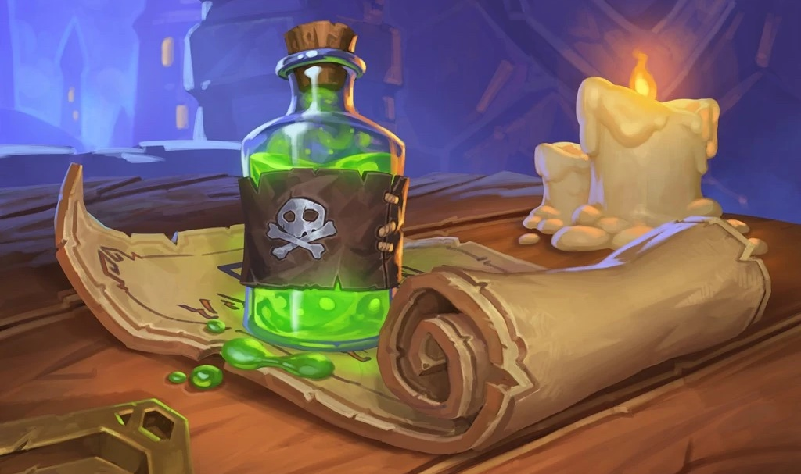

## Factions
Various factions have roots in Gadgetzan. Each faction vying for more power and influence over the direction of the city's development. Every organization in Gadgetzan can conflict with one another or work together towards a signular goal.

Factions provide different benefits to adventurers they view as an asset to their cause. You decide the extent to which a faction will assist the adventurers, based on each faction's perception of how important or valuable the adventurers are.

### Order of the Lantern
Primarily operating out of the Govern District, the Lanterns are comprised of individuals who advance through the City Watch and have proven their loyalty to the city. They are the peacekeepers and defenders of Gadgetzan. Lately, with the influence of more dubious parties in Gadgetzan, even these, normally honest, paragons of duty have seen their morals tested by the temptations of coin.

#### Leader
**Utgur Platebane**, a dwarf, who grew up on the dangerous side of the Docks District. During his childhood he bore witness to just how savage people can be to one another when left with no choice. A natural born fighter, Utgur was quickly scouted by the City Watch at a young age. At first, he joined out of necessisty but soon embraced his new charge. Utgur brings swift justice to those that prey upon the weak and his reputation for doing so led him to ascending through the ranks of the City Watch and then that of the Order of the Lantern, until he became its leading flame.

#### Goals
Defenders of order and a bastion of light in the darkness, the Order of the Lantern seeks to eradicate all evil and corruption they see, whatever the costs.

#### Support Actions
- Adventurers may request the aid of a respected and powerful member.

- City Watch officials are notified that the characters are on "official business" for the Order of the Lantern and instructed to provide support whenever they can.

### Makers Collective
A representing body for the numerous guilds in Gadgetzan, the Makers Collective offers all registered guilds, no matter the size, a voice in matters that affect commerence and trade. The Collective works in partnership with the governing bodies of Gadgetzan to ensure that peace and prosperty continue to blossom in the City of Opportunity.

#### Leader
**Gazlow**, a goblin, immigrated to Gadgetzan when his tribe was destroyed for their constant attacks on innocent villages. He saw firsthand how mindless acts of violence only furthers more violence. A gifted inventor Gazlow quickly made a name for himself as a renown supplier of gizmos and knick knacks. Using his wealth, Gazlow bought himself a seat in the Makers Collective. With his intelligence, he became the head chair and oversees the Collective's daily operations. Gazlow is quick thinking and a firm believer that nothing is ever given for free. He will only intervene if there is something for him to gain.

#### Goals
The Makers Collective act on behalf of all guilds within its membership and as such the group will do whatever it can to ensure nothing gets in the way of its members' prosperity.

#### Support Actions
- If the adventurers are accosted and overwhelmed, one or more Collective members come to their rescue.

- The Collective makes common and uncommon potions and scrolls available to the adventurers at a reduced or deferred cost depending on the circumstances.

### Dark Talons
The Dark Talons are a mercenary company made of up dishonorables and castaways from noble houses. The group is always looking for new members to fill the ranks, and loyalty is a highly valued trait in potential members. The Talons execl at inflitration and assassination contracts, primarily those targeted at other organizations, be it governmental or criminal.

#### Leader
**Istor Kilndar**, a drow, disgraced by his family and exiled into the deserts where Gadgetzan lies. Istor started the Dark Talons as a party of individuals in similiar circumstances who wished to exact vengence on those that had imposed such dishonor on their lives. Yet once they had accomplished their goals, Istor realized that the demand for talented killers never waivered and the potential it hinted at led him to gradually grow his humble party into a vast organization of assassins and inflitrators. Istor spends his time honing his abilities and ensuring each member live up to the honor of being a Dark Talons assassin.

#### Goals
The Dark Talons are a band of warriors through and through, they want nothing more than to perfect their murderous art.

#### Support Actions
- Adventurers may request a member attempt to buy off or quietly dispose of individuals who threaten them.

- The adventurers receive small, unmarked black pouches ofcoins from an anonymous source.

### Guild of Dungeoneers
Dungeoneers perform a wide array of jobs. These jobs can range from exploring long lost tombs to resucing someone's cat from a treant. The Guild of Dungeoneers provides assistance to any individual that seeks it. Often times, its member can be seen under the employ of other factions as well as businesses within the districts. The flexibility of the Dungeoneers makes them a wild card for the political climate of Gadgetzan. Though they claim to always help those in need, it is normally the size of the victims' coffers that determine the quality of the help rendered.

#### Leader
**Xanthar**, a beholder, pulls the strings of the Guild of Dungeoneers from behind a curtain of agents. Xanthar views all humaniod races as inferior to his own and very few have ever met him. He uses the guild, and by extension the adventurers it employes, as a means for locating lost and powerful artifacts. He is a paranoid and greedy collector of information, wealth, and power.

#### Goals
The Guild of Dungeoneers are collectors of rare and priceless artifacts. They want only to grow their collection.

#### Support Actions
- Adventurers can request support in the form of a magical item with limited uses.

- The guild grants access to secret tunnels and safe houses (hidden cellars) underneath Gadgetzan.