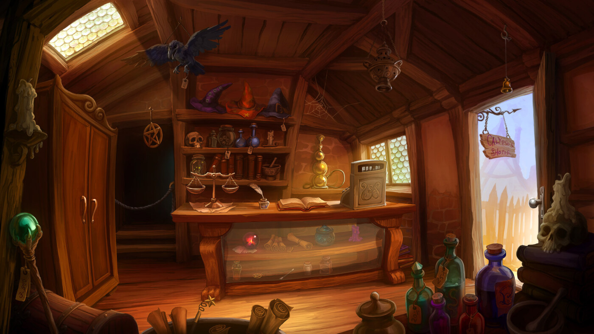

#### Content
- [Book Wyrm](#book-wyrm)
- [Fala's Potent Potions](#falas-potent-potions)
- [Odds and Ends](#odds-and-ends)
- [Steam and Steel](#steam-and-steel)
- [The Bent Nail](#the-bent-nail)
- [The Private Eye](#the-private-eye)

## Shops
Stores in Gadgetzan are owned by independent shopkeepers as well as affliated guild memebers. Most shops will always have a patron or two already browsing and conversing before the characters arrive. As such, merchants and their place of business are an ideal staging area for the characters to gain knowledge of the current events happening throughout the city and region.

Like any busy port city, Gadgetzan is filled to the brim with all sorts of businesses. Below are examples of local shops, their owners and services. Each shop listed can be used as an inspiration for custom places of business or placed directly into any district of the city, as is.

### Odds and Ends [^](#content)
This general store is nothing more than a large warehouse. **Gil Moore**, a former mercenary turned merchant, runs this shop. Gil is a muscled from his years of service and is friendly towards all customers that visit his business. Gil has connections with a slew of peddlers, allowing him to keep his shop inventory full and varied. 

#### Services
At Odds and Ends, patrons can find almost all types of mundane adventuring gear. Occasionally, and for a limited time only, Gil will have in stock exotic weapons and armors procurred from his business connections.

### The Bent Nail [^](#content)
A small wooden sign above this shop's main door is bare except for a large, bent nail sticking out of it. The front room contains displays of ornate wooden furniture, as well as a selection of bows and crossbows. The wall behind the counter is lined with rows of finely carved wooden canes, quarterstaffs, and shields. **Talisolvanar "Tally" Fellbranch**, the owner and chief artisan of the Bent Nail, is a male half-elf carpenter and woodcarver.

#### Services
Tally sells wooden weapons and shields at normal cost. He also crafts and sells furniture and wood sculptures.

### Fala's Potent Potions [^](#content)
**Fala Lefaliir**, an herbalist and a member of the Guild of Apothecaries and Physicians, operates out of this stately, three-story town house, the third floor of which has been converted into a greenhouse. Its translucent glass walls allow anyone on the street to see the rainbow of flowers blossoming within. Fala Lefaliir is an outgoing wood elf with long, braided hair.

#### Services
In addition to nonmagical herbal remedies, Fala sells potions of the types listed in the table below. Fala keeps 1d6 vials of each potion in locked cabinets behind the shop counter.

| Potions                     | Cost   |
|-----------------------------|--------|
| Potion of animal friendship | 125 gp |
| Potion of climbing          | 50 gp  |
| Potion of greater healing   | 250 gp |
| Potion of healing           | 50 gp  |
| Potion of water breathing   | 250 gp |

### The Private Eye [^](#content)
This private detective's business is unremarkable on the outside, its only distinguishing mark a black-and-white sign featuring an ominous eye. Inside is a regal apartment dimly lit by flickering oil lamps. The door is locked, and visitors must knock or ring the bell before being let in.

They are met by **Vincent Trench**, a goblin detective and the owner of the Private Eye. He speaks concisely, dresses in a sharp suit, and smokes a slim pipe.

#### Services
Trench can discover any secret in Waterdeep, for a fee. Use your judgment when pricing his services; 50 gp is sufficient for most investigations, but if the characters want to learn secrets relating to the major antagonists of this adventure, the man might require a service in payment, such as slaying enemies that are hunting him, posting advertisements for his business in their tavern, or keeping tabs on someone Vincent has been hired to spy on.

### Steam and Steel [^](#content)
During daylight hours, smoke and steam billow from the many windows around this indoor forge where metal weapons, armor, and tools are made. The forge is owned and operated by a married couple: a fire genasi named **Embric** and a water genasi named **Avi**. Both are members of the Most Careful Order of Skilled Smiths and Metalforgers. As an armorer, Avi also belongs
to the Splendid Order of Armorers, Locksmiths, and Finesmiths.

#### Services
The genasi couple sells all standard metal weapons, armor, and shields at normal cost.

### Book Wyrm [^](#content)
The front of this bookstore is adorned with a charming sign of a gold dragon curled around a treasure hoard of books and scrolls. Inside, the shop is decorated with beautiful hardwood, and the earthy scent of old books permeates the air. The library fills two floors of this three-story building, and it somehow seems to contain more shelves than the building should be able to hold.

The shop is managed by a short dragonborn of gold dragon ancestry named **Rishaal the Page-Turner**, who lives on the third floor

#### Services
The shop contains books of all sorts. In addition, Rishaal has a small collection of spellbooks and allows wizards to copy spells from them at the cost listed in the table below. He can scribe any of these spells as a spell scroll but charges twice the listed cost for this service.

| Spell                                                                                                             | Cost per Spell |
|-------------------------------------------------------------------------------------------------------------------|----------------|
| Comprehend languages, detect magic, featherfall, find familiar, mage armor, magic missile, shield, unseen servant | 25 gp          |
| Arcane lock, continual flame, darkvision, invisibility, magic weapon, misty step, rope trick, suggestion          | 75 gp          |
| Clairvoyance, counterspell, dispel magic, fireball, fly, nondetection, water breathing                            | 150 gp         |
| Arcane eye, fabricate, greater invisibility, ice storm, locate creature, polymorph                                | 300 gp         |
| Bigby's hand, cone of cold, modify memory                                                                         | 750 gp         |