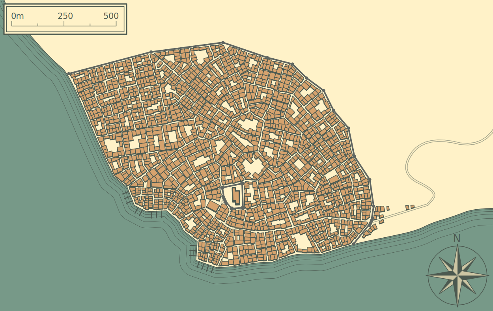

# Introduction
{.float-right}
Rising out of the northern deserts, a vibrant city, stands against the blistering heat. Gagetzan is the capital city for business and trade to artisans of any race.

Some of the best engineers, miners, and alchemists ply their trade here. The people here believe in profit above loyalty, thus Gadgetzan is considered neutral territory in any large-scale conflict. Anyone with a fat wallet or services to offer is welcomed in Gadgetzan.

The **Gadgetzan Gazette** campaign setting module provides information and reference material on the busy desert city of Gadgetzan. Characters adventuring through it will have to navigate the city's tumultuous environment. Maybe they'll make a name for themselves amongst the rabble or an enemy of one of the ruling gangs. Anything is possible in Gadgetzan, the City of Opportunity.

## Background
The bustling town of Gadgetzan has ushered in a new era of trade, but the city’s success has led to its unfortunate occupation by some rather unruly denizens, each with their own agendas. Crime families vie with the City Watch for control of the streets, each led by a powerful figurehead pulling the strings from the shadows.

Nestled deep in the desert, the port town of Gadgetzan was a haven for shady dealings and rule-bending trade, its locals and visitors showing no favoritism toward any government body outside its own.

With the construction of its new port, trade boomed in Gadgetzan. The influx of trade stuffed the coffers of those on the ground floor of the development of new Gadgetzan. Everyone who was anyone wanted a piece of the action, using all the tricks up their sleeves to get the upper hand. Organized crime developed as the power struggle began to grow in the now bustling Gadgetzan—it was no longer the sleepy city it once was!

## Life in Gadgetzan
City-based adventures can be challenging to run. especially if your player characters are inclined to wander. Keeping the characters in Gadgetzan, where the action is, requires that they feel at home. To that end, here are some points to keep in mind:
- Almost anything can be bought or sold in Gadgetzan. There's no need for adventurers to shop elsewhere.

- Gadgetzans generally hold adventurers in high regard, given that many of the city's most esteemed citizens are former adventurers and that the city has been saved countless times by adventurers over the years.

- Adventurers who are invested in the city are less likely to want to leave it. As your players flesh out their characters' backgrounds, encourage them to establish roots in Gadgetzan. A good Gadgetzan adventure further invests the characters by awarding them property in the city and giving them opportunities to join local factions and guilds.

### Breaking the Law
{.float-right}
Gadgetzan is a city of firm laws and swift justice. Adventurers hell-bent on slaughter and plunder won't fare well in the City of Opportunity. The punishments for assault, arson, theft, and murder are severe, regardless of the reason for the crime.

Characters who overtly engage in criminal behavior are quickly cornered and arrested by members of the City Watch. Those charged with committing a crime are brought before a magister to be judged. Advocates might intercede on behalf of the characters if they have allied themselves with influential NPCs and factions.

Gadgetzan has a growing crime problem and, as such, its laws are strictly enforced. It's possible that the adventure could end with one or more of the characters being exiled, sentenced to several years of hard labor, imprisoned, or put to death. If that's how their adventure ends, so be it. Hopefully, your next group will fare better.

### Getting About
Gadgetzan is a city of broad boulevards that thrum with traffic. All day and well into the night, a bewildering melee of wagons, carts, horse and pony riders, carriages, buggies, hire-coaches, and automobiles surge through its major thoroughfares. Fortunately, most roads are flanked by paved sidewalks that give pedestrians plenty of space, and most of the widest roads have raised dividers that allow an individual crossing a street a safe space to step out of the fray and wait for traffic to pass.

Thanks to the many guilds, Gadgetzan has a remarkable custom of labeling its streets, and even many of its alleyways and courts. The method of identification varies by district and neighborhood (including brass plates, carvings in stone, and stencil-painted wooden signs), but street names are typically displayed on the corners of buildings at intersections, roughly a dozen feet above ground. The name of the road you travel on will be on the wall nearest, while the name of the crossing road will be around the corner.

### City Amenities
{.float-right}
In most other towns and cities, you'll start with an early-morning stumble on the stairs as you carry your night soil down to deposit it outside. But in Gadgetzan, many buildings are connected directly to the sewers. Public facilities for those out and about can be found all around the districts' largest plazas.

Also notice how clean the streets are kept. This upkeep is due in large part to the hard work of the many cleaning guilds and their oozes. These groups can be seen working their brooms and carts at every hour of the day and for a few hours after dark-all over the city, removing not just animal dung but other refuse. This service is free to all, paid for by taxes rendered to the city.

Another amenity soon appreciated by visitors is Gadgetzan's water system. With public fountains and wells all about the city, clean water is plentiful. Many buildings have pumps of their own to draw water from the local supply, and some even possess taps that pour out water with the twist of a knob. This convenience is made possible by the inventiveness of the artisans and tinkerers that call the city home.

Let us not forget that no city in the world is as literate as Gadgetzan. Its literary guilds offer free instruction in reading to all who desire it, and the city has over thirty publishers of broadsheets in addition to chapbook printers and book publishers. Large paper advertisements are plastered onto alley walls, and smaller ones are passed out by those hired by businesses to trumpet their services. Printed menus can be found posted in the windows of most eateries and are handed out to those who dine within.

Lastly, Gagetzan is a technological hub. All of these amenities are ony possible due to the people that live within its walls. With artisans, builders, inventors, and sorccers from all walks of life rubbing shoulders together, it is no surprise that the lively city is home to all manner of inventions. From steam powered automobiles to the hydraulic printing presses employed by advertisment agencys and publishers alike, Gadgetzan's brilliant inventors are constantly crafting wonders that elevate the city and its citizenry to new heights!

## Gadgetzan City Map
